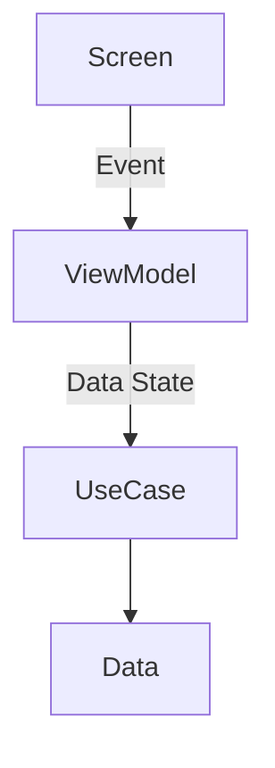
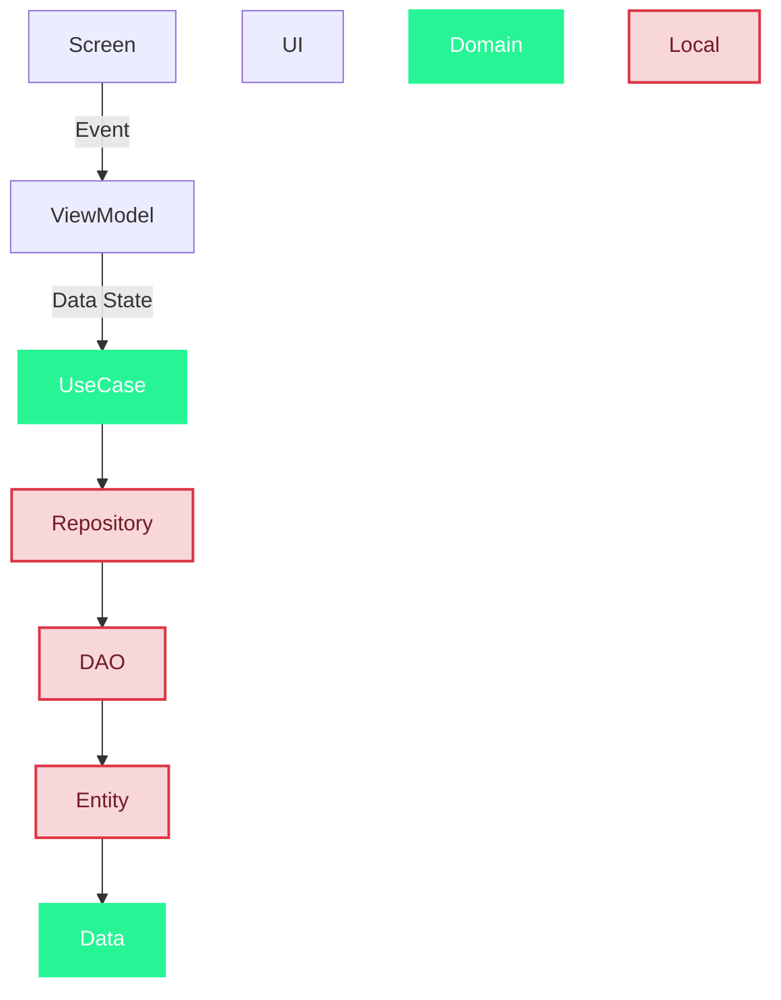

### Stockage

* #### Les préférences
	* Stockage primitif (clé/valeur)
	
* #### Les fichiers
	* Stockage spécifique et privé
	* Stockage partagé et publique

* #### Les bases de données
	* Stockage Structuré(SQLite & Room)

### Les préférences
```kotlin
val Context.dataStore by preferenceDataStroe(name="settings")
```
Infos courtes 


### Les Fichiers
__Stockage interne__, idéal pour le JSON, XML et CSV

```kotlin
openFileOutput("data.json", MODE_PRIVATE).use {
	it.write(json.toByteArray())
} 
```

### Les bases de données
On arrête les requete comme : 

```SQL
CREATE TABLE USERS (id INTEGER PRIMARY KEY, name TEXT, email TEXT)
```

Plus moderne , on utilise une surcouche métier ave cune api utilisable en __Kotlin__ sans Kotlin avec Room

```Kotlin
@Entity
data class User(@PrimaryKey val id: Int, val name : String, val email : String )
```


### Shema mis à jour

 


